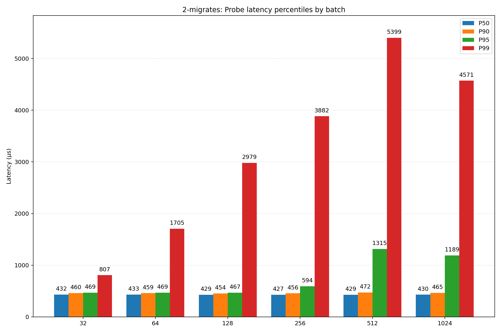
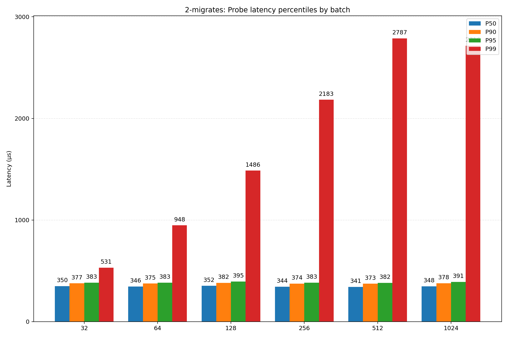
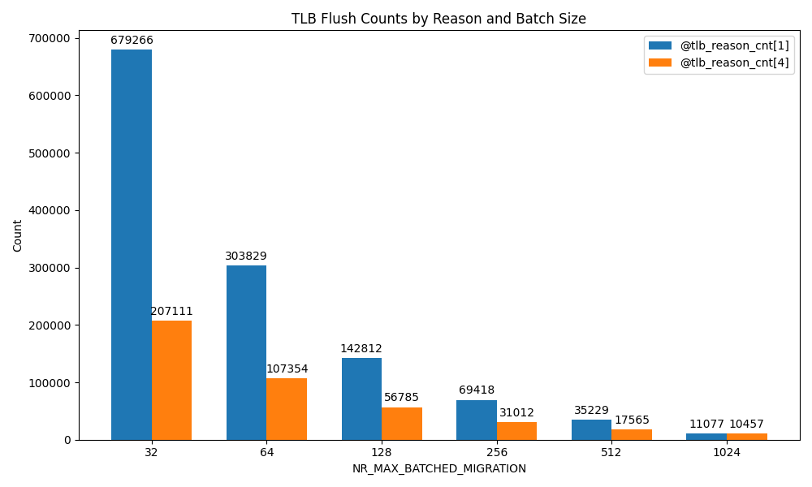

# Directory Tree

```
.
├── bin
│   └── benchmark
├── README.md
├── res
│   ├── high_migrate_load
│   │   ├── 1-migrates
│   │   ├── 2-migrates
│   │   │   ├── 1024.txt
│   │   │   ├── ...
│   │   │   ├── 32.txt
│   │   │   ├── probe_latency_2-migrates.pdf
│   │   │   └── probe_latency_2-migrates.png
│   │   └── 4-migrates
│   │       ├── 1024.txt
│   │       ├── ...
│   │       └── 32.txt
│   ├── low_migrate_load
│   │   └── 2-migrates
│   │       ├── 1024.txt
│   │       ├── ...
│   │       ├── 32.txt
│   │       ├── probe_latency_2-migrates.pdf
│   │       └── probe_latency_2-migrates.png
│   └── tlb_shootdown_count
│       ├── 1024.txt
│       ├── ...
│       ├── 32.txt
│       └── tlb_flush_counts.png
├── scripts
│   ├── bpftrace
│   │   ├── move_pages.bt
│   │   └── tlb_shootdown.bt
│   ├── plot
│   │   ├── draw.py
│   │   ├── summarize.py
│   │   └── tlb_count.py
│   ├── repeat.sh
│   ├── run-high.sh
│   └── run-low.sh
└── src
    └── benchmark.c
```

# Introduction

## NR_MAX_BATCHED_MIGRATION, 512

This macro, defined in **/mm/migrate.c**, specifies the **maximum number of pages** that can be migrated **in a single batch**.

Due to the performance gap between local and remote memory on NUMA systems, the Linux kernel performs **page migration** in multiple scenarios (e.g., via **/proc/sys/kernel/numa_balancing** for automatic detection and migration, or the **move_pages()** system call for manual migration). The prototype of **move_pages()** is:

```c
long move_pages(int pid, unsigned long count, void *pages[count],
const int nodes[count], int status[count], int flags);
```

Its return value semantics are:

* **0**: migration succeeded;
* **> 0**: the number of pages that failed to migrate (usually less than `count`);
* **< 0**: the syscall failed early due to an error.

Regardless of the trigger, actual migration is carried out by **migrate_pages()**, defined as:

```c
int migrate_pages(struct list_head *from, new_folio_t  get_new_folio,
        free_folio_t  put_new_folio, unsigned long private,
        enum migrate_mode mode, int reason, unsigned int *ret_succeeded)
```

## Workflow (Overview)

The function proceeds roughly as follows:

* **Isolation**: target pages are isolated from LRU and related lists to prevent reclaim or interference during migration.
* **PTE update**: the kernel walks all page tables referencing the physical page and replaces the original PTE with a special **migration entry**. This atomically blocks accesses through that PTE; any access attempts are stalled until migration completes.
* **Data copy**: a new physical page is allocated on the destination NUMA node, and the old page’s content is copied over.
* **Remap**: after copying, the migration entry is replaced with a valid PTE pointing to the new physical page.
* **Cleanup**: the old page is freed, and blocked tasks are unblocked.

## Details

Additional details in the above process:

* Candidate pages are first linked into a **list** (ordered by destination NUMA node). When actually migrating, the list is **split into batches no longer than `NR_MAX_BATCHED_MIGRATION`** for submission.
* The syscall follows a **“fail fast”** rule: once **do_pages_move()** receives a **positive** return from **migrate_pages()** (indicating some pages did not migrate), it **immediately ends** the syscall and **counts the remaining unattempted pages as “not migrated”** in the return value. This can leave performance on the table—some later pages might have succeeded but are skipped.
* After submitting a migration, because original-node PTEs become invalid, a **TLB shootdown** is issued, incurring non-trivial overhead (IPIs and global waiting).
* For migrations initiated by **move_pages()**, the migration mode is commonly described as **“3 async + 7 sync”** (asynchronous attempts followed by synchronous retries).

## References

From mailing list discussions ([https://lkml.indiana.edu/1904.0/04237.html](https://lkml.indiana.edu/1904.0/04237.html)) and the paper ([https://arxiv.org/abs/2503.17685](https://arxiv.org/abs/2503.17685)), **the macro’s performance impact mainly emerges under concurrency**. In the paper, a memory database continuously issues queries to data located on a remote NUMA node; a migration thread pulls hot pages to the local node to reduce query latency and improve throughput. **We mirror this setup as follows:**

* **Load construction**: pin a set of worker threads on **dst_node**, continuously issuing random reads/writes to a large mmap area with configurable access patterns (e.g., 20/80 hot/cold), forming stable **QPS** (Queries Per Second).
* **Periodic migration**: spawn a separate migrate thread that periodically performs batched **move_pages()** for “hot-window pages not on **dst_node**,” pulling hot pages local; collect migration latency and success/failure stats.
* **Observation**: record QPS throughput and latency percentiles, initial/final residency distributions, migration throughput, etc., to compare different batch strategies.

# Experiment Commands

We used the following commands to emulate different loads:

## 1. High Migration Pressure

Simulate a **rolling hot set** (every 1 second, the window fully advances by one window width). The migration thread must continuously move pages to keep up, creating many query/migration conflicts and thus exposing batch-size effects on tail latency.

```bash
sudo ./benchmark \
  --pages 2097152 --workers 24 --migrates {4, 2, 1} \
  --src 1 --dst 0 --batch 8192 --migrate-interval 0 \
  --hot-frac 0.20 --hot-prob 0.80 --hot-rotate 1 --rotate-step full \
  --drain-per-window 0 --only-src --restat \
  --qps-sample-ms 10 --probe 2000 50 \
  --duration 30
```

## 2. Low Migration Pressure

Fix the hot set and reduce the amount of data to be migrated so that a **50 ms** migration interval suffices for demand:

```bash
sudo ../bin/benchmark \
  --pages 2097152 --workers 24 --migrates 2 \
  --src 1 --dst 0 --batch 2048 --migrate-interval 50 \
  --hot-frac 0.125 --hot-prob 1 --hot-rotate 0 \
  --drain-per-window 3 --only-src \
  --qps-sample-ms 10 --probe 2000 50 \
  --duration 30
```

## Parameter Notes

* **pages**: total pages to migrate; here the total is **8 GiB**.
* **workers, migrates**: numbers of query and migration threads (test box: **56 logical CPUs**, **2 NUMA nodes**).
* **src, dst**: source and destination NUMA nodes (here **1 → 0**).
* **batch**: user-space **collection cap per attempt** (set to **8192**, far above **512**, to hit the kernel’s `NR_MAX_BATCHED_MIGRATION` behavior).
* **hot-frac, hot-prob**: hot-set fraction and access probability.
* **hot-rotate N, rotate-step full**: rotate the hot window every **N seconds**; **full** means shifting **HOT_BASE** forward by exactly one window width (window size is determined by **hot-frac**).
* **drain-per-window N**: **0 disables**; when **N > 0**, the migration thread performs at most **N** rounds of “collect + migrate” within the same hot-window period.
* **qps-sample-ms, probe**: record QPS and latency percentiles over sampling windows.
* **duration**: total runtime.

## Results

Change kernel **`NR_MAX_BATCHED_MIGRATION`** and run **≥ 10 trials** per setting; average the results. Results go here:

- High Migration Pressure Latency:


- Low Migration Pressure Latency:


- TLB Shootdown count at different batch size:


## Analysis & Conclusions

From the experiments, we conclude:

* Under **high migration pressure**, with **1/2/4** migration threads, the fraction of **failed pages** (fail / total) is approximately **0%, 32%, 58%**; with the **same** number of migration threads, **smaller batches** steadily improve the **success ratio** (**succ/fail**):

  **“Fail-fast” semantics amplify large-batch failures**
  With current **move_pages()** semantics, once **migrate_pages()** returns a **positive** value (some pages didn’t migrate / need retry), the syscall **terminates immediately**, and all remaining unattempted pages are **counted as failures**. Larger batches are more likely to hit a temporarily non-migratable page (writeback, locked, pinned, THP requiring split, etc.), prematurely ending the whole batch and misclassifying many later pages that might have succeeded. Smaller batches **shard the risk**, so each “bad page” wastes only a tiny attempt.

  **Batching unfolds under `MIGRATE_ASYNC`; larger batches collide with locks/conditions more often**
  When the accumulated count reaches **`NR_MAX_BATCHED_MIGRATION` (default 512)**, the list is split and submitted. Batching is done **only in `MIGRATE_ASYNC`** to avoid deadlocks from holding multiple page locks. Larger batches require more pages to be **pre-unmapped and marked with migration entries**, increasing chances of cross-mapping lock/contention issues (anon/revmap, writeback, refcounts, etc.). With multiple migration threads, these probabilities **compound**.

  **Statistically, the chance of “hitting a bad page” rises with batch size**
  Treating “temporarily non-migratable” as a low-probability event, the probability that a batch of size **n** contains **at least one** such page grows with **n**; hitting one triggers early termination and “unattempted pages” counted as failures. Smaller **n** breaks the total work into more independent attempts: although it increases the **number of TLB shootdowns**, it **improves net progress** (successful vs. failed pages).

* **Query latency** improves (lower **p95/p99**) as **batch** shrinks, under both high and low migration pressure:

  **Shorter “migration critical sections” and fewer simultaneous migration entries**
  Migration temporarily converts PTEs to migration entries; queries touching those pages stall until completion (or redirection). Larger batches mean more pages are “in migration” for longer; any query hitting such pages suffers head-of-line blocking, to which tail percentiles are very sensitive. Smaller batches shorten each stall window and reduce the number of concurrent queries that encounter migration entries.

  **TLB shootdown “pulses” become shorter and finer**
  PTE changes trigger cross-CPU TLB shootdowns (IPIs + waits) with non-trivial, jittery costs. Concentrating many PTE changes in one burst causes a **low-frequency, high-amplitude** disturbance. Smaller batches cut one big pulse into multiple **shorter** ones, turning the disturbance into **higher-frequency, lower-amplitude** wiggles, which reduces p95/p99 detriment.

  **Lock hold times and cross-page operations gain locality**
  **migrate_pages_batch()** prefers “unmap as much as possible first, then move.” Oversized batches stretch the syscall duration due to cross-folio locks (page lock, reverse map structures) and condition checks amid concurrency and writeback/splitting. Smaller batches turn one long transaction into multiple short ones, reducing contention windows with query threads on hot pages.
