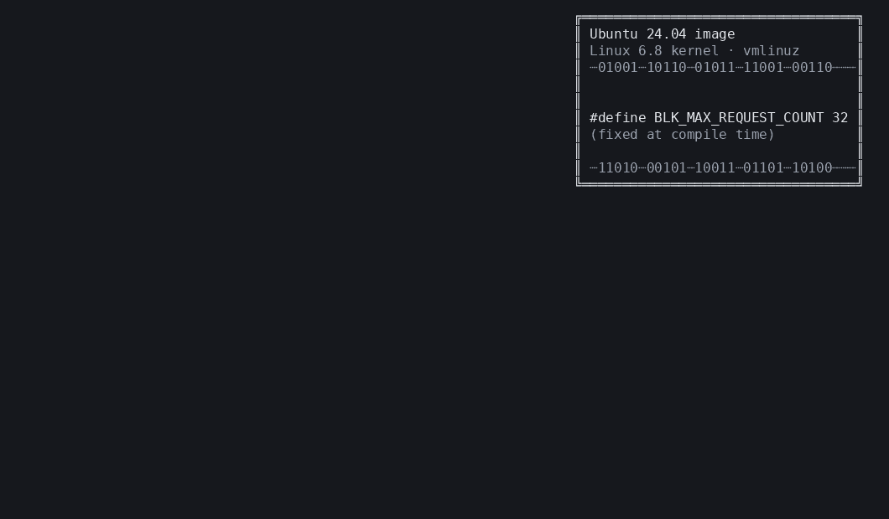

# Xkernel

**Xkernel** (KernelX) implements *Scoped Indirect Execution* (SIE) for runtime tuning of hardcoded performance constants in the Linux kernel — without recompilation or reboot.

Our paper: 

*Xkernel: Principled Performance Tunability of Operating System Kernels* ([OSDI'26](https://www.usenix.org/system/files/osdi26-chen-zhongjie.pdf))

## 30-Second Demo

```bash
# 0. Install dependencies (first time only)
./xkernel-tool setup

# 1. Set kernel source path:
export KERNEL_DIR=~/linux-6.8.0

# 2. Build + load in one step
./xkernel-tool run tunables/blk_max_request_count.toml

# 3. Check status
sudo ./xkernel-tool status
```



## How It Works

Linux contains hundreds of performance constants (`BLK_MAX_REQUEST_COUNT=128`, `MAX_SOFTIRQ_RESTART=10`, etc.) baked into the binary at compile time. SIE modifies their effect at runtime through three steps:

1. **Binary Diff** — Recompile the kernel with modified constant values and diff the assembly to locate the *Critical Span* (CS): the instruction sequence where the constant enters the architectural state.
2. **Symbolic Execution** — Derive the compiler's transformation `IV = f(V)` (e.g., `IV = V`, `IV = V << 3`) by symbolically executing the three BB versions.
3. **BPF Kprobe Synthesis** — Attach a kprobe after the CS that overwrites the register/memory with the new value, effectively replacing the constant at runtime.

```
tunables/*.toml ──→ gen.py (binary diff) ──→ codegen.py (symbolic exec) ──→ BPF stubs
                                                                               │
                    xkernel-tool load ←── bpftool loadall ←── clang -target bpf
                         │
                         ▼
                    Kprobe fires → overwrites register/memory → constant is tuned
```

### Consistency Models

| Mode | Name | Behavior |
|------|------|----------|
| 0 | Immediate | Takes effect instantly |
| 1 | Per-task | Each thread transitions when its stack exits the Safe Span (SS) |
| 2 | Global | `stop_machine` + stack scan ensures all threads exit SS before activation |

> **Note on Safe Span (SS)**: SS is the transitive data dependency slice from the Critical Span — it covers all instructions where constant-derived values are still live. Transition checking uses SS ranges to determine when a thread is safe. When SS is not explicitly specified (via `safe_spans` in testcases), CS ranges are used as a conservative approximation.

## Environment Setup

### Optional: install the Figure 10/11 kernel from source

```shell
bash install.sh
```

Most users should start with `xkernel-tool setup` below. The helper above is
only for preparing a local Linux 6.14.8-061408-generic build; the artifact
instructions for Figure 10 and Figure 11 provide the preferred mainline-kernel
package installation path.

### Install dependencies

One-click install (clang, llvm, libbpf, vmlinux.h, pytest):

```shell
./xkernel-tool setup
```

Or install selectively:

```shell
sudo bash scripts/install_deps.sh --apt      # Only apt packages
sudo bash scripts/install_deps.sh --libbpf   # Only libbpf
sudo bash scripts/install_deps.sh --vmlinux  # Only vmlinux.h
```

<details><summary>Manual installation</summary>

```shell
sudo apt-get install clang llvm pahole pkg-config libelf-dev -y
```

```shell
# Latest libbpf
git clone https://github.com/libbpf/libbpf.git && \
  pushd libbpf/src && make -j$(nproc) && sudo make install && \
  sudo cp ./*.so /usr/local/lib/ && sudo ldconfig && popd
```

</details>

### Set kernel source path

The build pipeline needs the kernel source tree. Set `KERNEL_DIR` to point to it:

```shell
export KERNEL_DIR=~/linux-6.8.0
```

Alternatively, add `kernel_dir = "~/linux-6.8.0"` in your TOML config.
The env var takes precedence over the TOML field.

> **Artifact evaluation note:** Most AE figures use Linux 6.8 and
> `KERNEL_DIR=~/linux-6.8.0`, while Figure 10 and Figure 11 use Linux
> 6.14.8-061408-generic and
> `KERNEL_DIR=~/linux-6.14.8-061408-generic`. See `ae/README.md` and the
> figure-specific README files for the exact reproduction steps.

### Build kernel modules (optional)

Kernel modules (`xk-kfuncs.ko`, `xk-consistency.ko`) are **auto-built** on first `load`.
To build them manually:

```shell
cd kernel && ./build.sh
```

## Quick Start

### 1. Define tunables

Create a TOML config file in `tunables/` (or use one of the provided single
tunable configs such as `tunables/blk_max_request_count.toml`):

```toml
[[tunables]]
name = "BLK_MQ_RESOURCE_DELAY"
description = "block/blk-mq.c resource delay"
file = "block/blk-mq.c"
original = "BLK_MQ_RESOURCE_DELAY\t3"
modified = ["BLK_MQ_RESOURCE_DELAY\t5", "BLK_MQ_RESOURCE_DELAY\t7"]
values = [3, 5, 7]

  [[tunables.safe_spans]]
  function = "blk_mq_dispatch_rq_list"
  start_offset = "0x10"
  end_offset = "0x90"
```

Each tunable provides three values `(V1, V2, V3)`. The pipeline recompiles the kernel twice (`V1→V2`, `V1→V3`), diffs the binary, and uses symbolic execution to derive the transformation relationship.

The optional `safe_spans` field specifies Safe Span (SS) ranges as `(function, start_offset, end_offset)` entries. These ranges tell the consistency model where constant-derived values are still live. When omitted, Xkernel can either invoke an LLVM taint analysis (`--run-analysis`) or fall back to a conservative auto-SS that covers the entire CS function. See [`docs/ss-analysis.md`](docs/ss-analysis.md) for the full SS resolution flow.

### 2. Build + load (one step)

```shell
# Set kernel source path (if not in TOML)
export KERNEL_DIR=~/linux-6.8.0

# Build and load in one step (default: immediate mode)
./xkernel-tool run tunables/blk_max_request_count.toml

# With per-task consistency
./xkernel-tool run tunables/blk_max_request_count.toml --mode 1

# Build only (no load)
./xkernel-tool build tunables/blk_max_request_count.toml
```

The build pipeline runs three stages:
1. **gen.py** — Binary diff + Basic Block extraction → `bb_cache/`
2. **codegen.py** — Symbolic execution + BPF code generation → `bpf/stubs/xtune_stub_N.bpf.c`
3. **make** — Compile BPF programs → `.bpf.o`

Use `--skip-gen` to skip the (slow) diff/BB stage when only codegen or compilation is needed:

```shell
./xkernel-tool run tunables/blk_max_request_count.toml --skip-gen
```

### 3. Load a constant

Kernel modules are auto-built and loaded as needed.

```shell
# Immediate mode
./xkernel-tool load 0 1

# Per-task consistency
./xkernel-tool load 1 2

# Global consistency (5s timeout)
./xkernel-tool load 2 3 5

# With jump optimization
./xkernel-tool load 0 1 --jump-opt
```

### 4. Check status

```shell
sudo ./xkernel-tool status
```

### 5. Unload

```shell
# Unload a specific ConstID
sudo ./xkernel-tool unload 1

# Unload everything
sudo ./xkernel-tool unload --all
```

### 6. Clean up

```shell
# Remove runtime state, compiled .bpf.o, bb_cache/
./xkernel-tool clean

# Also remove generated source files and kernel module builds
./xkernel-tool clean --all
```

## CLI Reference

```
Usage: xkernel-tool <command> [options]

Commands:
  run       Build + load in one step (recommended)
  build     Run the full pipeline (gen → codegen → compile)
  load      Load BPF kprobes for a single ConstID
  unload    Unload BPF kprobes (per-ConstID or all)
  status    Show runtime status of loaded ConstIDs
  table     Manage scope tables (list, query, delete, cs, ss)
  trace     Display kernel BPF trace logs
  gen       Generate an X-tune policy stub for a ConstID
  clean     Remove generated artifacts and runtime state
  doctor    Check system prerequisites
  setup     Install all dependencies (clang, llvm, libbpf, ...)

Environment:
  KERNEL_DIR  Path to kernel source tree (overrides TOML kernel_dir)

Options for 'run':
  <config.toml> TOML config file
  --mode N      Consistency mode: 0=Immediate (default), 1=Per-task, 2=Global
  --skip-gen    Skip gen.py (only run codegen + compile + load)
  --verbose     Show detailed codegen output
  --jump-opt    Probe candidate offsets for 5-byte JMP optimization

Options for 'build':
  <config.toml> TOML config file
  --skip-gen    Skip gen.py (only run codegen + make)
  --verbose     Show detailed codegen output

Options for 'load':
  <MODE>        0=Immediate, 1=Per-task, 2=Global
  <ConstID>     ConstID number from the scope table
  [timeout]     Timeout in seconds for Mode 2 (default: 5)
  --jump-opt    Probe candidate offsets for 5-byte JMP optimization

Options for 'unload':
  <ConstID>     Unload a specific ConstID
  --all         Unload all active ConstIDs and kernel modules

Options for 'clean':
  (no args)     Remove runtime state, .bpf.o files, bb_cache/
  --all         Also remove generated .bpf.c/.bpf.h and kernel module builds

Options for 'table':
  list                    List all scope table entries
  query [filters]         Query entries with filters
  delete [filters|--all]  Delete entries
  cs [--index N]          Show Critical Span entries
  ss [--index N]          Show Safe Span entries
```

## Project Structure

```
Xkernel/
├── src/                            # Core pipeline
│   ├── cli.py                      # xkernel-tool CLI
│   ├── diff.py                     # Binary diff engine
│   ├── gen.py                      # BB file generator (calls diff.py)
│   ├── codegen.py                  # Symbolic execution + BPF code generation
│   ├── config.py                   # TOML config loader (TunableConfig)
│   ├── loader.py                   # BPF loading/unloading lifecycle
│   ├── table.py                    # Scope/CS/SS table management
│   └── xtune.py                    # X-tune stub generator
├── bpf/                            # BPF runtime
│   ├── xkernel.bpf.h              # BPF runtime (transition_done, cs_map, etc.)
│   ├── kfuncs.bpf.h               # kfunc declarations
│   ├── util.bpf.h                 # Register read/write macros (BPF_SET_EAX, etc.)
│   ├── x_tune.h                   # X-tune programmable policy API
│   ├── cs_artifact.bpf.h          # Auto-generated: per-task CS handler
│   ├── Makefile
│   └── stubs/                     # Auto-generated SIE stubs
├── kernel/                         # Kernel modules (auto-built on first load)
│   ├── kfuncs/                     # xk-kfuncs.ko: exports kfuncs to BPF
│   ├── consistency/                # xk-consistency.ko: global transition coordinator
│   └── build.sh
├── tunables/                       # TOML config files
│   ├── all.toml                    # Linux 6.8 aggregate tunables
│   └── blk_max_request_count.toml  # Single tunable example
├── tests/                          # Unit tests (pytest)
├── scripts/                        # Helper scripts
│   ├── check_deps.sh              # Prerequisite checker (xkernel-tool doctor)
│   └── install_deps.sh            # Dependency installer (xkernel-tool setup)
├── ae/                             # Artifact evaluation scripts
├── examples/policy/                # Sample X-tune policies from the paper
├── docs/                           # Documentation
│   ├── quickstart.md              # End-to-end walkthrough
│   ├── adding-a-tunable.md        # Guide for new tunables
│   └── jump_optimization.md       # Jump optimization design
├── bb_cache/                       # (generated) Basic Block files
├── legacy/                         # Earlier prototypes and experiment scripts
├── xkernel-tool                    # CLI entry point
├── pyproject.toml                  # Python packaging config
├── build.sh                        # Full build script (deps + modules + BPF)
└── install.sh                      # Optional Linux 6.14.8 helper for Figure 10/11
```

## Data Flow

```
tunables/*.toml                 ← Define constants to tune (TOML config)
    │
    ▼
xkernel-tool build <config.toml>
    ├── gen.py → diff.py (×2)  ← Recompile kernel, binary diff → bb_cache/
    ├── codegen.py              ← Symbolic execution → derive IV = f(V)
    │   ├── Generate bpf/stubs/xtune_stub_N.bpf.{c,h}
    │   └── Write /dev/shm/xkernel/{scope_table, cs_table, cs_raw, ss_raw}
    └── make -C bpf/            ← Compile .bpf.c → .bpf.o
    │
    ▼
xkernel-tool load <mode> <N>   ← Attach kprobes, manage consistency
    ├── Resolve function addresses via /proc/kallsyms
    ├── Auto-build & load xk-kfuncs.ko (if needed)
    ├── bpftool loadall → /sys/fs/bpf/xkernel/N/
    ├── Populate cs_map/ss_map with CS/SS ranges
    └── [Mode 2] insmod xk-consistency.ko → wait → activate → rmmod
```

## Synthesis Types

The codegen automatically detects and handles three synthesis patterns:

| Type | Seed Instruction | Strategy |
|------|-----------------|----------|
| **Simple** | `mov $imm, %reg` | Single kprobe after seed: overwrite register |
| **Irreversible** | `shr`/`shl`/`imul`/`and` | Two kprobes: save original value before seed, apply new computation after |
| **Memory-store** | `movl $imm, disp(%reg)` | Single kprobe after store: rewrite memory via `bpf_probe_write_kernel` |

## Runtime State

```
/dev/shm/xkernel/
├── scope_table     ← ConstID → BPF file mapping, status
├── cs_table        ← Critical Span instruction sequences
├── cs_raw          ← Unresolved CS entries (function+offset)
├── cs              ← Resolved CS entries (function+address+offsets)
├── ss_raw          ← Unresolved SS entries (function+offset)
├── ss              ← Resolved SS entries (for transition checking)
└── runtime_state   ← JSON: active ConstIDs, loaded modules

/sys/fs/bpf/xkernel/<ConstID>/
├── progs/          ← Pinned BPF programs
└── maps/           ← Pinned BPF maps (cs_map, ss_map, task_storage, etc.)
```

## Writing Tuning Policies (X-tune)

KernelX provides a programmable policy plane where you write eBPF code to decide
when and how to change a perf-const value:

```bash
# 1. Build a tunable (or use 'run' to build + load)
./xkernel-tool build tunables/blk_max_request_count.toml

# 2. Generate a fresh policy stub (or edit the auto-generated one)
./xkernel-tool gen 1 -o my_policy.bpf.c

# 3. Edit my_policy.bpf.c with your logic, then load
sudo ./xkernel-tool load 0 1
```

See `examples/policy/` for sample X-tune programs from the paper, including
RTT-aware TCP CUBIC tuning, per-shrinker memory control, and application-hinted
block I/O.

## Testing

```bash
# Run unit tests (no custom kernel needed)
python3 -m pytest tests/ -v

# Check system prerequisites
bash scripts/check_deps.sh
# or:
./xkernel-tool doctor
```

## Artifact Evaluation

Experiment scripts for reproducing paper figures are in `ae/`:

```bash
sudo bash ae/run_all.sh        # Run reproducible experiments
sudo bash ae/exp3_shrink_batch.sh  # Run a single experiment
```

See [ae/README.md](ae/README.md) for details on each experiment.

## Troubleshooting

| Problem | Solution |
|---------|----------|
| `Kernel source directory not specified` | `export KERNEL_DIR=~/linux-6.8.0` or add `kernel_dir` to your TOML |
| `Kernel source directory not found` | Verify `KERNEL_DIR` points to a valid kernel source tree |
| `bpftool: command not found` | `./xkernel-tool setup` or build from kernel source |
| `vmlinux.h not found` | `./xkernel-tool setup --vmlinux` or `bpftool btf dump file /sys/kernel/btf/vmlinux format c > bpf/vmlinux.h` |
| `kfuncs module not loaded` | Auto-built on `load`. Manual: `cd kernel && ./build.sh && sudo insmod kfuncs/xk-kfuncs.ko` |
| `ConstID not found` | Run `./xkernel-tool build` first, then `./xkernel-tool table list` |
| `BPF compilation fails` | `./xkernel-tool doctor` to check deps. Need clang ≥14 + `bpf/vmlinux.h` |
| `Operation not permitted` on `.bpf.o` | Stale root-owned file from `sudo`. Fixed automatically, or `sudo rm bpf/stubs/*.o` |
| `Permission denied` | Load/unload commands need root — `xkernel-tool` will call `sudo` as needed |
